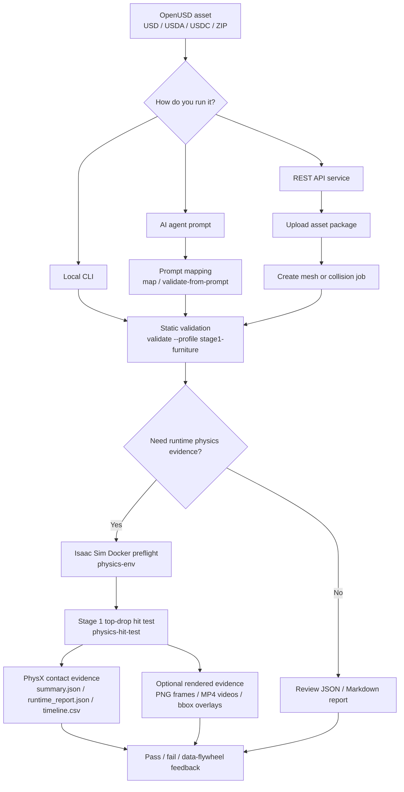

# omni-asset-cli

`omni-asset-cli` is a unified CLI for OpenUSD asset validation and Isaac Sim Docker runtime physics checks. It wraps NVIDIA Omniverse Asset Validator, adds Stage 1 furniture/prop presets, and produces JSON, Markdown, timeline, and runtime evidence artifacts for humans, CI, and AI agents.

`omni-asset-cli` 是一个面向 OpenUSD 资产校验和 Isaac Sim Docker runtime 物理检查的统一 CLI。它封装 NVIDIA Omniverse Asset Validator，提供 Stage 1 家具/摆件推荐流程，并输出 JSON、Markdown、timeline 和 runtime evidence 产物，方便人工复核、CI 和 AI agent 使用。

## Quick Start / 快速开始

```bash
git clone git@github.com:songshen06/omni-asset-cli.git
cd omni-asset-cli
python3 -m pip install --no-build-isolation -e ".[validator]"
omni-asset-cli env
omni-asset-cli validate examples/minimal_scene.usda --profile stage1-furniture
```

You can also run the source entry point directly:

```bash
python3 omni_asset_cli.py env
python3 omni_asset_cli.py validate examples/minimal_scene.usda --profile stage1-furniture
```

## Workflow / 使用流程



## Main Commands / 核心命令

```bash
omni-asset-cli validate path/to/asset.usd --profile stage1-furniture
```

```bash
python3 omni_asset_cli.py physics-env \
  --runtime-docker-container isaac-sim
```

```bash
python3 omni_asset_cli.py physics-hit-test path/to/asset.usd \
  --template-scene examples/mini_test.usda \
  --placement-mode replace-table \
  --hit-mode top-drop \
  --size-policy preserve \
  --frames 240 \
  --out out/asset_docker_hit \
  --runtime-docker-container isaac-sim \
  --docker-workspace /workspace/omni-asset-cli
```

For the fixed Stage 1 runtime workflow, use the wrapper command. It runs the
Docker preflight, executes the standard top-drop hit test, and writes
`workflow_report.json` next to `summary.json`, `runtime_report.json`, and
`timeline.csv`. The default `standard` evidence preset also captures
front/side/top/iso videos with physics bbox overlays and records Docker access
diagnostics in the workflow report:

```bash
python3 omni_asset_cli.py stage1-runtime path/to/asset.usd \
  --out out/asset_stage1_runtime
```

Use `--evidence-preset contact-only` for a faster run that skips rendered
video evidence.

## Documentation / 详细文档

- 中文使用文档：[docs/USER_GUIDE.zh.md](docs/USER_GUIDE.zh.md)
- English user guide: [docs/USER_GUIDE.en.md](docs/USER_GUIDE.en.md)
- Testing notes / 测试说明: [docs/TESTING.md](docs/TESTING.md)
- Deployment notes / 部署说明: [DEPLOYMENT.md](DEPLOYMENT.md)
- Changelog / 更新说明: [CHANGELOG.md](CHANGELOG.md)
- Agent skill package: [omni-asset-cli-agent/SKILL.md](omni-asset-cli-agent/SKILL.md)

## Repository Layout / 目录结构

```text
omni_asset_cli.py                         # Unified CLI entry point
omni_asset_service/                       # Optional REST API service
omniverse-usd-asset-validator/scripts/    # Validator and runtime helper scripts
omniverse-usd-asset-validator/references/ # Detailed reference notes
examples/                                 # Sample USD assets and templates
docs/                                     # User-facing guides
```

## Runtime Requirement / Runtime 要求

Authoritative `physics-hit-test` runtime validation requires Linux with Isaac Sim Docker. Host Python dispatches the job; the Docker child process loads `SimulationApp` and writes the runtime artifacts.

权威的 `physics-hit-test` runtime 物理验证需要 Linux + Isaac Sim Docker。宿主机 Python 只负责调度任务，Docker 子进程负责加载 `SimulationApp` 并写出 runtime 产物。
