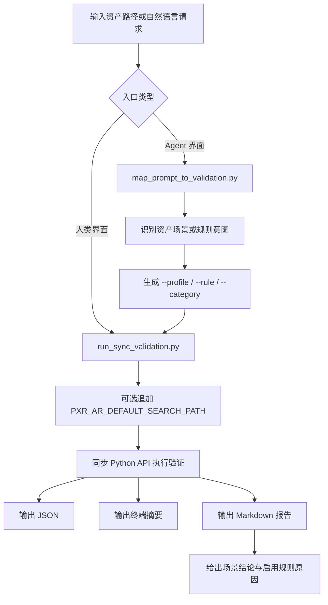
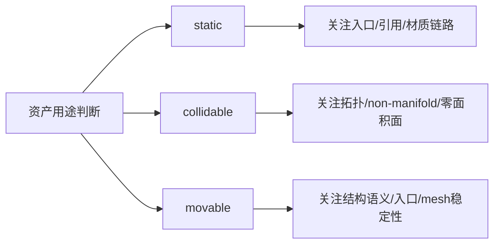

# Omniverse USD Asset Validator Skill 项目文档

## 1. 项目目标

本项目的目标是构建一个符合 `agentskills.io` 规范的 Agent Skill，使 Agent 能够基于自然语言请求对 USD 资产执行 NVIDIA Omniverse Asset Validator 校验，并输出结构化结果与面向用户的简明结论。

本项目当前采用的是 NVIDIA `omniverse-asset-validator` 独立 Python 包方案，而非 Omniverse Kit 插件 UI 方案。

## 2. 当前结论

项目已经完成以下能力：

- Skill 目录结构已建立并通过校验
- 安装与环境要求已文档化
- 自然语言到验证参数的工作流已定义
- 自然语言到参数的自动映射脚本已落地
- 同步 Python API 验证脚本已落地
- 异步 CLI 包装脚本已落地
- 最小样例与真实资产的测试结果已记录
- 已形成“人类界面 + Agent 界面”双层执行设计
- 已形成三类资产场景的 profile 化规则策略
- 已支持在报告中解释“为什么这个场景启用这些 rules”
- 已支持通过 `PXR_AR_DEFAULT_SEARCH_PATH` 减少 MDL 路径误报

当前推荐的正式执行路径为：

- 对单个 USD 资产，优先使用同步 Python API 包装脚本
- 不再将原始 `omni_asset_validate` CLI 作为主执行入口

当前项目的阶段性判断为：

- 已经不是“脚本雏形”
- 已经具备 GitHub 展示、人工使用和 Agent 集成的基础形态
- 当前最稳定的主链路已经明确
- 当前可以进入“增强健壮性与批处理能力”的下一阶段

## 3. 技术方案

### 3.1 安装方式

推荐固定安装方式：

```bash
python3.10 -m venv .venv
source .venv/bin/activate
python -m pip install --upgrade pip
python -m pip install "omniverse-asset-validator[usd,numpy]"
```

推荐 Python 版本：

- 优先 `Python 3.10`
- 可接受范围 `Python 3.10 - 3.12`

### 3.2 执行路径

当前 skill 支持两条验证路径。

同步主路径：

- 脚本：`scripts/run_sync_validation.py`
- 底层实现：`ValidationEngine.validate(...)`
- 特点：稳定、可直接返回结果、可同时输出 JSON 与 Markdown 摘要，并区分执行状态与校验状态

异步观测路径：

- 脚本：`scripts/run_async_validation.py`
- 底层实现：`omni_asset_validate` CLI
- 特点：用于观察 CLI 行为、记录 timeout 状态，不建议作为主执行路径

### 3.3 两层执行界面

当前项目不是单一入口，而是两个执行层面共用同一条核心校验主链路。

人类界面：

- 入口：`scripts/run_sync_validation.py`
- 面向人群：技术美术、测试人员、实施人员、资产制作人员
- 特点：显式指定资产路径、显式指定 `--profile`、直接读取 JSON 与 Markdown

Agent 界面：

- 入口：`scripts/map_prompt_to_validation.py`
- 面向对象：Codex、ChatGPT Agent、自动化系统、工具链集成
- 特点：从自然语言推断资产场景、自动映射到 `--profile` 或具体规则，并生成可执行命令

设计原则：

- 人类界面强调可控、可调试、可复测
- Agent 界面强调可映射、可解释、可自动化
- 两者最终统一收敛到 `run_sync_validation.py`

### 3.4 自然语言处理策略

Skill 的职责是将自然语言请求映射为具体验证动作。例如：

- “检查这个 USD 有没有基础元数据问题”
  -> `StageMetadataChecker`

- “检查有没有丢失引用”
  -> `MissingReferenceChecker`

- “检查材质类问题”
  -> `Material` category

在默认情况下：

- 不自动启用 `--fix`
- 不默认走异步 CLI
- 优先产出 JSON
- 优先返回人类可读摘要

在当前版本中，自然语言处理还新增了场景识别能力：

- “按静态资产场景检查”
  -> `--profile static`

- “按可碰撞资产场景检查”
  -> `--profile collidable`

- “看这个机器人资产适不适合抓取和移动”
  -> `--profile movable`

## 4. 当前执行流程

### 4.1 总体流程图



### 4.2 三类资产场景流程图



## 5. 目录结构

当前 skill 目录如下：

```text
omniverse-usd-asset-validator/
omniverse-usd-asset-validator/SKILL.md
omniverse-usd-asset-validator/agents/openai.yaml
omniverse-usd-asset-validator/references/cli-mapping.md
omniverse-usd-asset-validator/references/cli-timeout-issue-zh.md
omniverse-usd-asset-validator/references/customer-setup-guide-zh.md
omniverse-usd-asset-validator/references/environment-and-setup.md
omniverse-usd-asset-validator/references/human-operator-guide-zh.md
omniverse-usd-asset-validator/references/kind-checker-explained-zh.md
omniverse-usd-asset-validator/references/natural-language-examples-zh.md
omniverse-usd-asset-validator/references/natural-language-to-args-zh.md
omniverse-usd-asset-validator/references/project-documentation-zh.md
omniverse-usd-asset-validator/references/test-result-boat.md
omniverse-usd-asset-validator/scripts/check_omniverse_asset_validator_env.py
omniverse-usd-asset-validator/scripts/map_prompt_to_validation.py
omniverse-usd-asset-validator/scripts/run_async_validation.py
omniverse-usd-asset-validator/scripts/run_sync_validation.py
```

## 6. 核心文件说明

### 6.1 `SKILL.md`

用途：

- 定义 skill 的触发描述
- 规定 agent 的工作流
- 明确默认执行方式
- 指明参考文档和脚本入口

### 6.2 `agents/openai.yaml`

用途：

- 提供 skill 的 UI 元数据
- 定义展示名、短描述和默认提示词

### 6.3 `references/environment-and-setup.md`

用途：

- 说明 Python 版本要求
- 说明安装方式
- 说明 CLI 与环境检查方法

### 6.4 `references/customer-setup-guide-zh.md`

用途：

- 提供正式中文部署与使用说明
- 面向客户或实施说明场景

### 6.5 `references/cli-mapping.md`

用途：

- 说明自然语言意图与验证参数的映射关系
- 作为 agent 选择 rule/category 的参考

### 6.6 `references/cli-timeout-issue-zh.md`

用途：

- 记录 `omni_asset_validate` CLI 异步超时问题
- 提供复现步骤与技术判断

### 6.7 `references/test-result-boat.md`

用途：

- 记录真实资产 `boat.usd` 的测试结果
- 包含 CLI timeout 现象与同步 API 复测结论

### 6.8 `references/natural-language-examples-zh.md`

用途：

- 汇总自然语言调用示例
- 用于提示词设计、测试样本和实施说明

### 6.9 `references/human-operator-guide-zh.md`

用途：

- 作为人类操作者的统一入口文档
- 说明推荐调用方式、状态字段、工作流和常见问题

### 6.10 `references/kind-checker-explained-zh.md`

用途：

- 解释 `KindChecker` 的通用含义
- 说明它为什么在 Isaac Sim / SimReady 结构检查中重要

### 6.11 `references/natural-language-to-args-zh.md`

用途：

- 说明自然语言如何映射到 `run_sync_validation.py` 参数
- 作为自然语言参数生成逻辑的参考依据

### 6.12 `scripts/check_omniverse_asset_validator_env.py`

用途：

- 检查 Python 版本
- 检查 CLI 是否可用
- 检查包是否已安装

### 6.13 `scripts/run_async_validation.py`

用途：

- 启动 CLI 异步验证
- 轮询结果文件
- 在超时场景下输出运行状态摘要

定位：

- 用于观察 CLI 行为
- 不作为默认主执行路径

### 6.14 `scripts/run_sync_validation.py`

用途：

- 通过同步 Python API 执行验证
- 输出 JSON
- 输出终端摘要
- 输出 Markdown 人类解读报告
- 区分 `execution_status` 与 `validation_status`
- 支持三类资产场景 `profile`
- 支持解释为什么当前场景启用这些规则
- 支持通过 `--pxr-ar-default-search-path` 追加解析器搜索路径

定位：

- 当前项目的默认主执行路径

### 6.15 `scripts/map_prompt_to_validation.py`

用途：

- 将自然语言请求映射为 `run_sync_validation.py` 参数
- 输出结构化映射结果
- 可选地直接执行映射后的验证命令
- 支持从自然语言推断 `static / collidable / movable`
- 支持将 `--pxr-ar-default-search-path` 透传给主验证脚本

定位：

- 当前项目的自然语言参数生成入口

## 7. 当前规则策略

### 7.1 `static`

适用对象：

- 展示资产
- 背景道具
- 静态摆放资产

当前重点规则：

- `StageMetadataChecker`
- `DefaultPrimChecker`
- `MissingReferenceChecker`
- `MaterialPathChecker`
- `UsdDanglingMaterialBinding`
- `UsdMaterialBindingApi`

原因：

- 静态资产最先暴露的问题通常是入口定义、引用完整性和材质链路
- 它不一定最怕 mesh 微小缺陷，但会非常受材质丢失和依赖缺失影响

### 7.2 `collidable`

适用对象：

- 碰撞资产
- 障碍物
- 物理接触检测资产

当前重点规则：

- `MissingReferenceChecker`
- `ValidateTopologyChecker`
- `ManifoldChecker`
- `ZeroAreaFaceChecker`
- `NormalsValidChecker`
- `WeldChecker`
- `ExtentsChecker`

原因：

- 碰撞相关场景最怕 mesh 拓扑不稳定
- non-manifold、零面积面、法线异常会直接影响碰撞与物理稳定性

### 7.3 `movable`

适用对象：

- 可移动资产
- 抓取资产
- 机器人交互资产

当前重点规则：

- `KindChecker`
- `DefaultPrimChecker`
- `StageMetadataChecker`
- `MissingReferenceChecker`
- `ValidateTopologyChecker`
- `ManifoldChecker`
- `NormalsValidChecker`

原因：

- 可移动资产不仅要可显示，还要结构语义清晰、层级稳定、几何质量可靠
- 对 Isaac Sim / SimReady / 机器人场景，`KindChecker` 的重要性会明显提高

## 8. 已完成测试

### 8.1 CLI 路径测试

测试结论：

- `omni_asset_validate` 在当前环境中会出现异步超时
- 最小样例与真实资产均可复现
- 日志可到 `99%`
- 但命令不正常退出

### 8.2 同步 Python API 路径测试

测试结论：

- `run_sync_validation.py` 可稳定返回
- 可成功输出 JSON
- 可输出面向用户的摘要
- 可生成 Markdown 报告供人工阅读
- 在资产校验失败时仍返回进程退出码 `0`
- 只有程序执行异常时才返回非零退出码

测试结果：

最小样例：

- 结果：`failed`
- 问题数：`2`
- 发现问题：缺少 `upAxis`、缺少 `metersPerUnit`

真实资产 `boat.usd`：

- 结果：`passed`
- 问题数：`0`
- 在 `StageMetadataChecker` 下未发现问题

Markdown 报告能力：

- 默认与 JSON 同路径、同文件名，仅扩展名改为 `.md`
- 报告内容包括执行摘要、人类判断、主要问题类型、代表问题和建议下一步

状态字段语义：

- `execution_status`
  - `completed`: 脚本已成功执行完成
  - `error`: 脚本本身运行失败

- `validation_status`
  - `passed`: 校验通过
  - `warning`: 有警告但无失败
  - `failed`: 有失败项
  - `blocked`: 未进入有效校验结果阶段

### 8.3 自然语言映射脚本测试

测试样例：

- `帮我检查这个 USD 的 stage metadata，只看 failure，并输出 json`

映射结果：

- `--rule StageMetadataChecker`
- `--predicate IsFailure`

该映射结果已通过真实执行验证最小样例，并成功输出同步校验结果。

### 8.4 场景 profile 测试

当前已完成以下能力验证：

- `run_sync_validation.py` 已支持 `--profile static`
- `run_sync_validation.py` 已支持 `--profile collidable`
- `run_sync_validation.py` 已支持 `--profile movable`
- 报告中已能解释当前场景启用了哪些规则，以及为什么启用

### 8.5 MDL 搜索路径健壮性处理

当前已完成以下能力验证：

- `run_sync_validation.py` 已支持 `--pxr-ar-default-search-path`
- 若环境中已有 `PXR_AR_DEFAULT_SEARCH_PATH`，脚本会在原值基础上追加，而不是覆盖
- `map_prompt_to_validation.py` 已支持透传该参数
- `check_omniverse_asset_validator_env.py` 已可显示当前环境中的 `PXR_AR_DEFAULT_SEARCH_PATH`

针对 `bottle.usd` 这类资产，当前判断是：

- 某些 `MaterialPathChecker` / `MissingReferenceChecker` 问题不一定说明资产本身损坏
- 更可能是 MDL 解析依赖了特定的 resolver search path
- 当补充 `PXR_AR_DEFAULT_SEARCH_PATH` 后，相关误报可以减少

结论：

- 这更像环境解析路径问题
- 不应简单归类为“USD 不规范”
- 但也说明该资产对外部环境存在隐式依赖，移植性较弱

## 9. 当前推荐使用方式

对单个资产，推荐命令如下：

```bash
python scripts/run_sync_validation.py /path/to/asset.usd --output-json /tmp/asset_validation.json
```

例如：

```bash
python scripts/run_sync_validation.py examples/boat_test/boat.usd --output-json /tmp/boat_sync.json --rule StageMetadataChecker
```

输出包括：

- `execution_status`
- `validation_status`
- `status`
- `issue_count`
- `severity_counts`
- 详细 issue 列表
- 人类可读终端摘要
- Markdown 报告

人类界面示例：

```bash
python scripts/run_sync_validation.py /path/to/asset.usd --profile movable --output-json /tmp/asset_validation.json
```

Agent 界面示例：

```bash
python scripts/map_prompt_to_validation.py /path/to/asset.usd "帮我按可碰撞资产场景检查这个 USD" --execute
```

带 MDL 搜索路径的示例：

```bash
python scripts/run_sync_validation.py /path/to/bottle.usd --profile static --pxr-ar-default-search-path /isaac-sim/kit/mdl/core/mdl
```

## 10. 当前项目判断

本项目当前已具备交付和继续扩展的基础条件。

正式判断如下：

- Skill 已完成并可被 agent 使用
- CLI 原生异步路径存在可靠性问题
- 同步 Python API 路径已验证可用
- 当前方案已具备双层执行界面
- 当前方案已具备场景化 profile 能力
- 当前方案已补充 MDL 搜索路径健壮性处理
- 当前方案适合继续扩展批量能力、环境自适应和更丰富的摘要生成能力

## 11. 后续建议

建议下一阶段继续完善以下内容：

1. 增加多资产或目录批量校验模式
2. 增加更完整的中文业务摘要模板
3. 增加对常见安装环境的 search path 自动探测能力
4. 如需对外反馈问题，可基于 `cli-timeout-issue-zh.md` 整理正式缺陷报告
